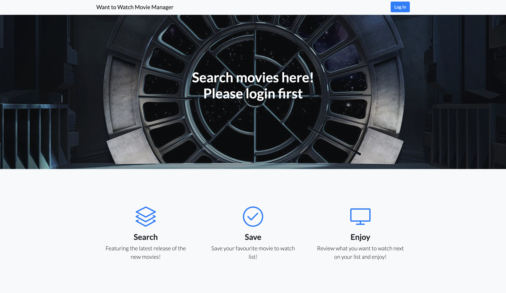

# Want-to-Watch Movie Manager
  

  ## Preview
  

  ## Description
  * Want-to-Watch Movie Manager is a website which allows users to search movies available in the market and keep track of them.
  * Deployed application on Heroku: https://damp-dusk-40026.herokuapp.com/

  ## Table of Contents
  * [Installation](#installation)
  * [Usage](#Usage)
  * [License](#License)
  * [Contributing](#Contributing)
  * [Questions](#Questions)

  ## Installation
  To install necessary dependencies, run the following command:

      npm i

  ## Usage
  1. Enter the Heroku link under [Description](#Description).
  2. Sign up or log in to members page.
  3. Enter a movie name in the search engine.
  4. Click save to save the movie to my list.
  5. open my list in navbar, and review the saved movies.
  6. To delete a movie, click on delete.
  7. Chatbot in my list popup page will be able to help you set up a google calender watch movie reminder.

  ## License
  * MIT

  ## Contributing
  The app is contributed by Josh, Chris, Antonio, Melody.

  ## Questions
  * If you have any questions, feel free to contact us via email.

